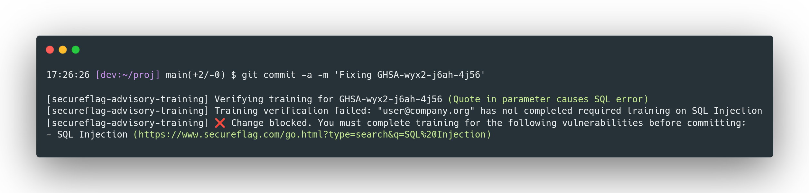

# SecureFlag GHSA Advisory Training Commit Hook

The `commit-msg-ghsa` hook enforces SecureFlag vulnerability training compliance for commits referencing GitHub Security Advisories (GHSA).



## What does it do?

- **Scans the commit message** for any GHSA IDs (e.g., `GHSA-xxxx-xxxx-xxxx`).
- For each GHSA ID found:
  - Checks the corresponding advisory in the current GitHub repository via the GitHub API.
  - Verifies, via the SecureFlag API, whether the committer has completed the required training for the referenced vulnerability.
- **Blocks the commit** if the committer has not completed the required training, and provides instructions and direct links to the relevant SecureFlag training.

## Installation

1. **Copy the hook to your repository's `.git/hooks/` directory:**

   ```sh
   cp commit-msg-ghsa .git/hooks/commit-msg
   chmod +x .git/hooks/commit-msg
   ```

2. **Install dependencies:**
   - Ensure [`jq`](https://stedolan.github.io/jq/) is installed and available in your `PATH`.

3. **Set required environment variables:**

   - `GITHUB_TOKEN`: GitHub Personal Access Token with security advisory read access. Generate at https://github.com/settings/tokens
   - `SECUREFLAG_API_TOKEN`: SecureFlag API token. Generate at https://www.secureflag.com/management/index.html#/settings

   You can export these in your shell profile or set them before committing:

   ```sh
   export GITHUB_TOKEN=ghp_xxx
   export SECUREFLAG_API_TOKEN=sf_xxx
   ```

## Usage

Once installed, the hook runs automatically on every commit. If your commit message references a GHSA ID, the hook will:

1. Extract all GHSA IDs from the commit message
2. Fetch advisory details from GitHub for each GHSA ID
3. Check if you've completed the required training for each vulnerability
4. Allow the commit if all training is complete, or block it with helpful error messages if not

### Example Commit Messages

**Will trigger the hook:**
```
Fix XSS vulnerability GHSA-1234-5678-90ab

This commit addresses the cross-site scripting issue
reported in GHSA-1234-5678-90ab by sanitizing user input.
```

**Will not trigger the hook:**
```
Fix XSS vulnerability

This commit addresses a cross-site scripting issue
by sanitizing user input.
```

## Configuration

### Environment Variables

| Variable | Required | Description |
|----------|----------|-------------|
| `GITHUB_TOKEN` | Yes | GitHub Personal Access Token with security advisory read access |
| `SECUREFLAG_API_TOKEN` | Yes | SecureFlag API token for training verification |
| `COMMITTER_EMAIL` | No | Override the email used for training verification (defaults to git config user.email) |
| `SECUREFLAG_API_ENDPOINT` | No | Override the SecureFlag API endpoint (defaults to the training verification endpoint) |
| `REMOTE` | No | Git remote name (defaults to "origin") |

### Editing the Hook

You can also edit the hook file directly to set default values. See the configuration section at the top of [commit-msg-ghsa](commit-msg-ghsa).

## How It Works

1. **GHSA ID Detection**: Uses regex to find all GHSA IDs in the commit message
2. **GitHub API Query**: For each GHSA ID, fetches the security advisory from your repository
3. **SecureFlag Verification**: Sends the advisory summary to SecureFlag API to:
   - Determine the vulnerability type
   - Check if you've completed training for that vulnerability in the last 365 days
4. **Decision**: Blocks the commit if any required training is incomplete

## Error Handling

The hook handles various error scenarios gracefully:

- **Missing jq**: Displays a warning and allows the commit
- **Missing tokens**: Blocks the commit with clear instructions
- **Invalid GitHub repository**: Blocks the commit if it can't determine the repo from git remote
- **Invalid email**: Warns and allows the commit if the email isn't registered in SecureFlag
- **API errors**: Warns and allows the commit if the SecureFlag API is unavailable
- **Advisory not found**: Warns but continues checking other advisories
- **Unrecognized vulnerability**: Warns and allows the commit if the advisory summary isn't descriptive enough

## Example Output

### Successful Training Verification
```
[secureflag-advisory-training] Verifying training for GHSA-1234-5678-90ab (Cross-site Scripting)
[secureflag-advisory-training] Training verification succeeded: "user@example.com" completed training on Cross-site Scripting (XSS) (GHSA-1234-5678-90ab)
```

### Blocked Commit
```
[secureflag-advisory-training] Verifying training for GHSA-1234-5678-90ab (SQL Injection)
[secureflag-advisory-training] Training verification failed: "user@example.com" has not completed required training on SQL Injection (GHSA-1234-5678-90ab)

[secureflag-advisory-training] ❌ Git action blocked. You must complete training for the following vulnerabilities before committing:
- SQL Injection (https://www.secureflag.com/go.html?type=search&q=SQL%20Injection)
```

## Troubleshooting

### "jq is required but not installed"
Install jq using your package manager:
```sh
# Ubuntu/Debian
sudo apt install jq

# macOS
brew install jq

# Fedora/RHEL
sudo dnf install jq
```

### "GITHUB_TOKEN and SECUREFLAG_API_TOKEN must be set"
Make sure you've exported both tokens. Check with:
```sh
echo $GITHUB_TOKEN
echo $SECUREFLAG_API_TOKEN
```

### "Access denied to security advisory"
Your `GITHUB_TOKEN` needs the `repo` scope or specific security advisory read permissions. Generate a new token at https://github.com/settings/tokens

### "Could not determine GitHub repository"
The hook needs to determine your GitHub repository from the git remote. Ensure your remote is properly configured:
```sh
git remote -v
```

### "User is not a valid user in SecureFlag"
Your git email must match your SecureFlag account email. Either:
1. Update your git email: `git config user.email "your-secureflag-email@example.com"`
2. Or set `COMMITTER_EMAIL` environment variable: `export COMMITTER_EMAIL="your-secureflag-email@example.com"`

## Bypassing the Hook (Not Recommended)

In emergencies, you can bypass the hook with:
```sh
git commit --no-verify -m "your message"
```

However, this defeats the purpose of the security compliance check and is not recommended.

## Integration with CI/CD

To use this hook in CI/CD pipelines:

1. Install the hook in your CI environment
2. Set `GITHUB_TOKEN` and `SECUREFLAG_API_TOKEN` as CI secrets
3. Ensure `jq` is available in the CI image
4. The hook will run automatically on commits

## Learn More

- [SecureFlag Platform](https://www.secureflag.com/)
- [GitHub Security Advisories](https://docs.github.com/en/code-security/security-advisories)
- [Git Hooks Documentation](https://git-scm.com/book/en/v2/Customizing-Git-Git-Hooks)
