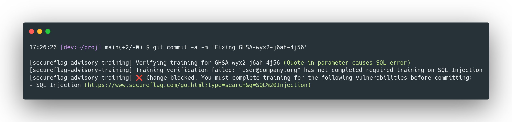

# SecureFlag Advisory Training Commit Hook

This directory contains a `commit-msg` Git hook that enforces SecureFlag vulnerability training compliance for commits referencing GitHub Security Advisories (GHSA).



## What does the `commit-msg` hook do?

- **Scans the commit message** for any GHSA IDs (e.g., `GHSA-xxxx-xxxx-xxxx`).
- For each GHSA ID found:
  - Checks the corresponding advisory in the current GitHub repository.
  - Verifies, via the SecureFlag API, whether the committer has completed the required training for the referenced vulnerability.
- **Blocks the commit** if the committer has not completed the required training, and provides instructions and direct links to the relevant SecureFlag training.

## Installation

1. **Copy the hook to your repository's `.git/hooks/` directory:**

   ```sh
   cp actions/githooks/commit-msg .git/hooks/commit-msg
   chmod +x .git/hooks/commit-msg
   ```

2. **Install dependencies:**
   - Ensure [`jq`](https://stedolan.github.io/jq/) is installed and available in your `PATH`.

3. **Set required environment variables:**

   - `GITHUB_TOKEN`: GitHub Personal Access Token with security advisory read access.
   - `SECUREFLAG_API_TOKEN`: SecureFlag API token.

   You can export these in your shell profile or set them before committing:

   ```sh
   export GITHUB_TOKEN=ghp_xxx
   export SECUREFLAG_API_TOKEN=sf_xxx
   ```

4. **Make a commit.**  
   If your commit message references a GHSA ID, the hook will verify your training status and block the commit if requirements are not met.

## Notes

- The hook only runs on commits whose messages reference a GHSA ID.
- If you encounter errors about missing tokens or permissions, check your environment variable setup and token scopes.
- For more information, see the comments in `commit-msg`.
